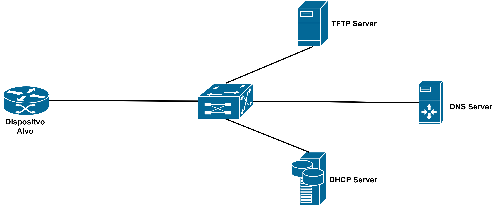
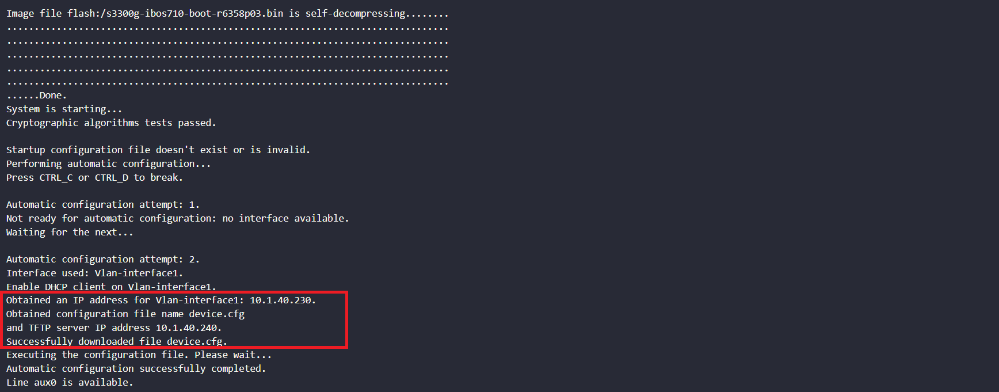
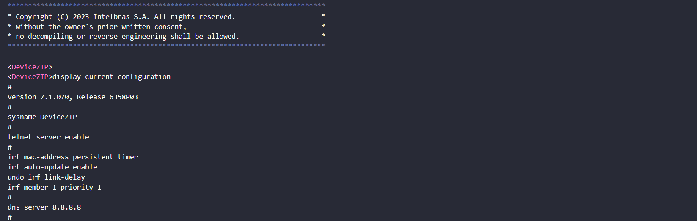

# ZTP (Zero Touch Provisioning) Appliance with Docker

This repository contains all the components required to host a ZTP appliance using Docker. It provides scripts and configurations to set up the environment, manage the application's containers, and comunication by application servers. 

---
Prerequisites, before you begin, ensure you have the following packages installed on your system:

- Git version 2.34.1
- Docker version 24.0.6, build ed223bc
- Docker Compose version v2.21.0

---
### Getting Started:

First, copy the line below and paste on your prompt to clone the repository:

```
git clone https://github.com/arthurcadore/capacita-ztp
```
If you don't have installed the package Git yet, do it before try to clone the respository!

Navigate to the project directory:

```
cd ./capacita-ztp
```

If you don't have Docker (and Docker-compose) installed on your system yet, it can be installed by run the following commands (Script for Ubuntu 22.04): 

```
./docker/installDocker.sh
```

**If you had to install docker, please remember to reboot you machine to grant user privileges for docker application.** 

### Application (DHCP/TFTP) Server Configuration:

First configure DHCP server files, you can do this by edditing the `.cfg` files in `/serverDHCP/` directory.

The configuration for `dhcpd.cfg` file by default is displayed below, this configuration is used for DHCP server operation in IPv4. 
```
option domain-name "capacitacao.intelbras.com.br";
option domain-name-servers 10.1.40.240;
option tftp-server-address 10.1.40.1;
option bootfile-name "device.cfg";
default-lease-time 600;
max-lease-time 7200;
ddns-update-style none;
```
Where, the `tftp-server-address` option point to TFTP server address, and `bootfile-name` option, point to the file-name that the switch will download from TFTP server when recive the DHCP parameters; 

The `subnet` configuration is based on your environment, so change-it by your own: 
```
subnet 10.1.40.0 netmask 255.255.255.0 {
  range 10.1.40.230 10.1.40.240;
  option routers 10.1.40.1;
  option subnet-mask 255.255.255.0;
  default-lease-time 600;
  max-lease-time 7200;
  option subnet-mask 255.255.255.0;
  option broadcast-address 255.255.255.0;
  option domain-name-servers 10.1.40.240;
  option domain-name "capacitacao.intelbras.com.br";
}
```

In sequence, for TFTP configuration, copy all files you want to share for devices to `/share/` directory (by default only device.cfg is hosted, this file carries some default configurations for testing porpuses).

```
serverTFTP@serverTFTP:~/share$ ls -l
-rw-rw-r-- 1 capacitadev capacitadev 92 Feb 25 14:01 device.cfg

```

### Start Application's Container: 
Run the command below to start docker-compose file: 

```
docker compose up & 
```

The "&" character creates a process id for the command inputed in, with means that the container will not stop when you close the terminal. 

---

### Access Application:

By default, the CLI access to the container is closed, so nobody can access it externally, only the application web Page. To access the application command line, first loggin into host device using SSH or another method, then use the command below: 

```
docker exec -it dhcpserver bash
```

For tftpserver container, witch is based on alpine linux, the default shell interpreter is `ash`, so use: 

```
docker exec -it dhcpserver ash
```

The command above will start a bash process in the application container, that with the -it (interative) flag will display the prompt to user. 

To exit from container's command line interface, use the command `exit`.  

--- 

### Operation References: 

Once the containers have started and the device has connected to the same LAN as the application servers, the ZTP client will receive the DHCP parameters and download the file from the TFTP server.

The topology for the ZTP appliance is depicted below:

[](./pictures/ztp-topology.png)

After receiving the DHCP parameters, the ZTP client will download the file from the TFTP server. Subsequently, the device will be provisioned with the configurations from the file, as shown below:

[](./pictures/ztp-in-progress.png)

Finally, the device prompt and current configuration will be changed, as demonstrated below:

[](./pictures/ztp-completed.png)

--- 

### Stop Container: 

To stop all running containers, you can use the following command:

```
docker-compose down
```

--- 
